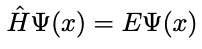

===========================
Schrodinger Equation Solver
===========================

.. image:: https://travis-ci.org/oddguan/Schrodinger-Equation-Solver.svg?branch=master
    :target: https://travis-ci.org/oddguan/Schrodinger-Equation-Solver

.. image:: https://coveralls.io/repos/github/oddguan/Schrodinger-Equation-Solver/badge.svg?branch=master
:target: https://coveralls.io/github/oddguan/Schrodinger-Equation-Solver?branch=master

Python Boilerplate contains all the boilerplate you need to create a Python package.

* Free software: MIT license

Introduction
--------
This is a program that solves the schrodinger equation, implemented in Python 
with TensorFlow. 

The Schrodinger Equation is given by the following:

Where H is an opereator that maps from L2 of complex functions to L2. 

The inner product is defined as followed:

.. iamge:: innerproduct.png

The definition of the H times Psi is:

..image:: hamiltonian.png

The goal of the project is to first project the hamiltonian into a fourier 
basis set, and solve the wavefunction representation corresponding to the lowest
energy state of the Hamiltonian. 

This is essentially a eigenvalue-eigenvector problem, if we managed to get a 
matrix representation of the hamiltonian operator. 

Usage
-------
To use the program in the simplest form, you can follow the commands below:

``git clone https://github.com/oddguan/Schrodinger-Equation-Solver``

``cd Schrodinger_Equation_Solver``

``python setup.py install``

``python schrodinger_equation_solver/schrodinger_equation_solver.py``

Note that you can only use python 3.6 for now, since tensorflow has not been
officially supported by python 3.7 yet. 

Arguments
--------
``--size, -s``: The size of the fourier basis set, default to 3. 

``-c``: a constant c in the equations above, default to 5.

``--input, -i``: a input file that contains the position and potential energy
of the system in a given time step. There is an exmple of the input file in 
the schrodinger_equation_solver package folder. In order to make the program 
work, one has to follow the same format to that file. 

Credits
-------

This package was created with Cookiecutter_ and the `audreyr/cookiecutter-pypackage`_ project template.

.. _Cookiecutter: https://github.com/audreyr/cookiecutter
.. _`audreyr/cookiecutter-pypackage`: https://github.com/audreyr/cookiecutter-pypackage
